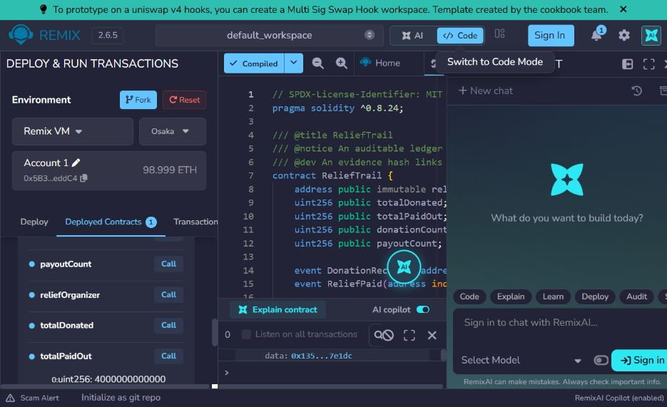

# ReliefTrail

### Transparent disaster-relief fund tracking prototype

ReliefTrail is a Solidity prototype for recording donations and organizer-authorized relief payouts in a publicly inspectable ledger. It explores how smart contracts can make recorded fund movements easier to review.

This is an early prototype that runs in Remix VM with simulated accounts and ETH. A blockchain can make submitted transactions inspectable, but it cannot prove a receipt is genuine or that aid reached anyone.

## Demonstration

The sample run records two donations totaling 1.5 ETH, then an organizer-authorized payout of 0.4 ETH, leaving 1.1 ETH in the contract. A payout attempted by a non-organizer account reverts.

All currency shown is simulated Remix VM test ETH. There is no public testnet or mainnet deployment. Remix VM contract addresses change when the local VM resets.

## Run locally in Remix

1. Open [Remix IDE](https://remix.ethereum.org/).
2. Create `ReliefTrail.sol` and paste the source from `contracts/ReliefTrail.sol`.
3. Select Solidity 0.8.24 or a compatible 0.8.x compiler and compile.
4. Under **Deploy & Run Transactions**, choose **Remix VM** and deploy. The deploying account becomes `reliefOrganizer`.
5. Select another account, set transaction **VALUE** to `1 Ether`, and call `donate()`. Repeat from a third account with `0.5 Ether`.
6. Confirm `totalDonated` is `1500000000000000000` wei and `donationCount` is `2`.
7. From the deploying account, call `payRelief` with a recipient account address, amount `400000000000000000` wei, purpose `emergency food kits`, and a nonzero 32-byte fingerprint such as `0x1111111111111111111111111111111111111111111111111111111111111111`.
8. Confirm `totalPaidOut` is `400000000000000000` wei, `payoutCount` is `1`, and `availableBalance` is `1100000000000000000` wei.
9. Select a non-organizer account and try a payout. It should revert with `OrganizerOnly`.

## Design and limitations

See [System Design](docs/ARCHITECTURE.md) for the components, transaction flow, contract rules, and trust boundaries.

The evidence fingerprint is public and does not validate the evidence itself. Keep receipts and personal information off-chain. The deployer has sole payout authority in this prototype; a production system would need independent governance, privacy protections, operational controls, and a security review.

## Repository contents

- `contracts/ReliefTrail.sol` — Solidity contract
- `docs/ARCHITECTURE.md` — system design and limitations
- `screenshots/relieftrail-remix-demo.jpg` — local Remix VM demonstration
- `LICENSE` — MIT License
