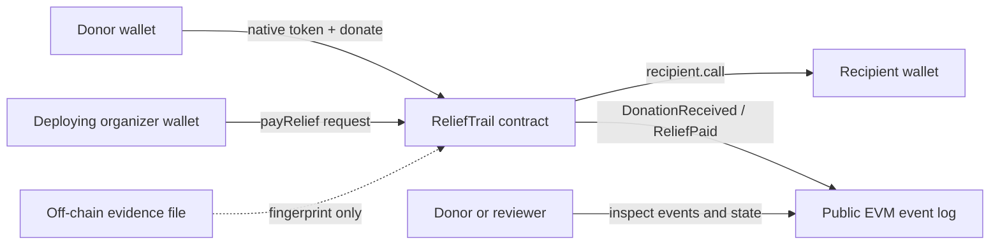

# ReliefTrail Blockchain architecture

## System shape

The contract is the authority for the rules encoded in it. Wallets sign transactions; the chain executes contract code and records successful state changes and events. No frontend, API, database, or evidence service is included in this repository.

## Components

- **ReliefTrail contract:** accepts nonzero native-token donations and tracks total/count state. It authorizes payouts only from the immutable deployer address, checks recipient, amount, purpose length, and nonzero evidence hash, updates state, then attempts the transfer.
- **Organizer wallet:** one address receives sole payout authority at deployment. This keeps the prototype small but creates a single key/approval risk.
- **Donor and recipient wallets:** submit contributions and receive payouts. The contract does not verify legal identity or organization affiliation.
- **Events:** expose donor/recipient, amount, balance, purpose, and supplied evidence fingerprint. Events and transaction history are public and permanent.
- **Off-chain evidence:** any source file must be handled outside the contract. A hash can compare a future file to a submitted fingerprint; it cannot prove provenance, truth, or delivery.
- **Hardhat:** compiles the contract and runs isolated tests on a local EVM. The Docker Compose service starts a local RPC node for manual integration work.

## Donation and payout flow

1. A donor calls `donate()` and sends a nonzero native-token value.
2. The contract increments `totalDonated` and `donationCount`, then emits `DonationReceived` with the resulting balance.
3. The organizer calls `payRelief(recipient, amount, purpose, evidenceHash)`.
4. The contract checks the caller, recipient, available balance, evidence hash, and public purpose length.
5. The contract updates payout totals before making an external call. If the recipient rejects the transfer, the entire transaction reverts and the state updates do not persist.
6. On success, `ReliefPaid` records the recipient, amount, purpose, and fingerprint.

## Key decisions and trade-offs

- **Native currency only:** avoids token approvals and token-specific edge cases. The contract is not currency-agnostic and has no conversion or accounting integration.
- **Single organizer:** simple to understand and test. It is unsuitable for real custody because one key can authorize all funds. A production design would need independent governance and recovery controls.
- **Event-based history:** transactions and events are easy to inspect. They do not prove real-world outcomes and may expose sensitive metadata.
- **Checks-effects-interactions:** accounting changes happen before the transfer; EVM revert semantics roll them back if the external call fails. This avoids leaving the accounting partially updated after a failed payment.
- **Evidence fingerprint:** ties a later-provided file to the submitted hash if the same hash function and bytes are used. It does not validate the file, identity, timing, or claim.
- **No payment-per-donation earmark:** all funds share one contract balance. The contract does not track donor restrictions, refund policy, accounting categories, or liabilities.

## Test strategy

The Hardhat suite deploys a fresh contract for each test. It covers deployer authorization, donation event/state/balance behavior, nonzero contribution checks, organizer-only payout, zero recipient, invalid amounts, missing/invalid public input, successful payout accounting, and a recipient contract that rejects payment. CI compiles and runs the suite without external RPC credentials.

## Demo and production boundary

The Remix screenshot uses simulated local ETH. The Sepolia deployment script is prepared but a public deployment is not claimed until it has been run and independently verified. No testnet private key belongs in Git or chat.

This prototype has no audit, multi-signature control, pause/recovery path, compliance process, private evidence service, monitoring, or incident response. It must not hold real funds. See the root README for the deployment checklist and limitations.
